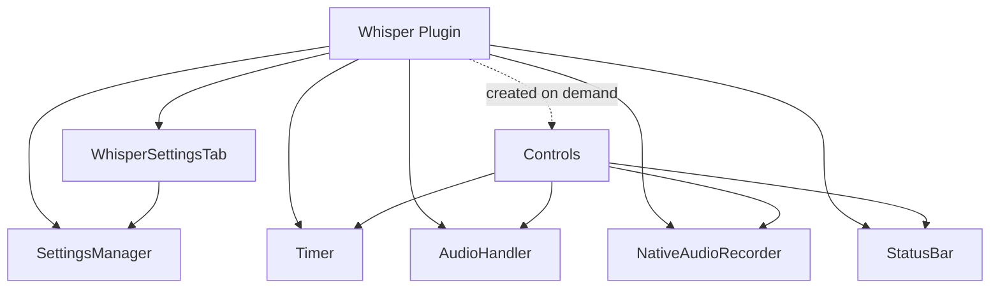

# Whisper plugin – high-level architecture

## Entry and build

- **Obsidian entry:** [main.ts](main.ts) exports the default `Whisper` class (extends Obsidian `Plugin`). Build output is `main.js` (esbuild from `main.ts`).
- **Manifest:** [manifest.json](manifest.json) identifies the plugin (id, name, version, minAppVersion); Obsidian loads `main.js` by convention.

---

## Class structure and ownership

All app logic lives under `src/`. The plugin instance is the single root that owns settings and core components.

**Core types:**

- **Whisper** ([main.ts](main.ts)) – Holds `settings: WhisperSettings`, `settingsManager`, `timer`, `recorder`, `audioHandler`, optional `controls`, `statusBar`. In `onload()`: loads settings, adds ribbon (opens Controls), settings tab, timer, AudioHandler, NativeAudioRecorder, StatusBar, and commands (start/stop recording, upload file).
- **SettingsManager** ([src/SettingsManager.ts](src/SettingsManager.ts)) – Loads/saves `WhisperSettings` via `plugin.loadData()` / `plugin.saveData()`. Defines `WhisperSettings` (API key/URL, model, prompt, language, save-audio/new-file toggles and paths, debug) and `DEFAULT_SETTINGS`.
- **WhisperSettingsTab** ([src/WhisperSettingsTab.ts](src/WhisperSettingsTab.ts)) – Obsidian `PluginSettingTab`. Uses plugin's `settingsManager`; in `display()` builds the settings UI and writes into `plugin.settings` then saves via `settingsManager.saveSettings()`.
- **Timer** ([src/Timer.ts](src/Timer.ts)) – Stateless elapsed-time counter (1s interval), `start()` / `pause()` / `reset()`, `getFormattedTime()`, optional `onUpdate` callback.
- **StatusBar** ([src/StatusBar.ts](src/StatusBar.ts)) – Single status bar item; shows `RecordingStatus` (Idle / Recording / Processing) and updates text/color.
- **Controls** ([src/Controls.ts](src/Controls.ts)) – Obsidian `Modal`. Holds Start/Pause/Stop buttons and timer display; wires button clicks to `recorder` and `audioHandler`, and uses `plugin.timer` with `setOnUpdate()` to refresh the display. Created lazily when the ribbon is clicked; closed in `onunload`.

**Audio abstraction:**

- **AudioRecorder** ([src/AudioRecorder.ts](src/AudioRecorder.ts)) – Interface: `startRecording()`, `pauseRecording()`, `stopRecording(): Promise<Blob>`.
- **NativeAudioRecorder** – Implements `AudioRecorder` using browser `MediaRecorder` and `getUserMedia`. Picks first supported MIME among `audio/webm`, `audio/ogg`, `audio/mp3`, `audio/mp4`; collects chunks every 100ms; on `stopRecording()` returns one `Blob` and stops stream tracks. Exposes `getMimeType()` and `getRecordingState()` for UI and file naming.

**Audio handling and output:**

- **AudioHandler** ([src/AudioHandler.ts](src/AudioHandler.ts)) – Receives `(blob: Blob, fileName: string)`. Uses [utils.getBaseFileName](src/utils.ts) for note naming. Builds paths from settings (`saveAudioFilePath`, `createNewFileAfterRecordingPath`). Optionally saves the blob to the vault (`writeBinary`). Sends a `FormData` (file, model, language, optional prompt) to `plugin.settings.apiUrl` with Bearer token; expects JSON `{ text: string }`. Then either creates a new note (with `![[audioFilePath]]` and transcription) and opens it, or inserts `response.data.text` at the cursor in the active Markdown view.

---

## How audio is passed through

Two entry points produce a `Blob` + filename; the rest of the pipeline is shared.

**Path 1 – Live recording (ribbon or command "Start/stop recording"):**

1. User starts recording → `StatusBar` → Recording; `NativeAudioRecorder.startRecording()` (getUserMedia → MediaRecorder, chunks pushed to array).
2. User stops → `StatusBar` → Processing; `recorder.stopRecording()` → Blob from chunks, MIME from recorder; filename from current date + extension from `getMimeType()`.
3. `audioHandler.sendAudioData(blob, fileName)` is called (from [main.ts](main.ts) command or from [Controls.ts](src/Controls.ts) Stop button).

**Path 2 – Upload file (command "Upload audio file"):**

1. File input; user picks a file → `file.slice(0, file.size, file.type)` gives a Blob, `fileName = file.name`.
2. Same call: `audioHandler.sendAudioData(audioBlob, fileName)`.

**Inside AudioHandler.sendAudioData():**

1. Resolve paths (audio save path, note path) from settings and filename/base name.
2. Optionally write blob to vault at `audioFilePath`.
3. Build FormData (file, model, language, optional prompt), POST to `apiUrl`, read `response.data.text`.
4. If "create new file": create note with embed + text, open it; else insert text at cursor in active Markdown editor.

So **audio flows as:** Microphone/File → **Blob** → **AudioHandler** → (optional vault write) + **HTTP POST** → **response.data.text** → **vault note** (new file or cursor insert).

---

## Data flow summary

| Stage            | Data form                    | Where                              |
| ---------------- | ---------------------------- | ---------------------------------- |
| Capture          | MediaStream                  | NativeAudioRecorder (internal)     |
| After stop/pick  | Blob + fileName              | Passed to AudioHandler             |
| Optional persist | Uint8Array                   | vault.adapter.writeBinary          |
| API              | FormData (Blob as file)      | axios POST                         |
| API response     | `{ text }`                   | Used for note content / insert     |
| Output           | New .md file or editor range | vault.create / editor.replaceRange |

No queues or background workers; recording and upload both run the same synchronous chain in the main process (status bar shows Processing until `sendAudioData` finishes).

---

## File map (source)

| File                                                   | Role                                                               |
| ------------------------------------------------------ | ------------------------------------------------------------------ |
| [main.ts](main.ts)                                     | Plugin class, wiring, commands (record, upload)                    |
| [src/AudioRecorder.ts](src/AudioRecorder.ts)           | AudioRecorder interface, NativeAudioRecorder (MediaRecorder)       |
| [src/AudioHandler.ts](src/AudioHandler.ts)             | sendAudioData: save blob, POST to Whisper API, create/insert note  |
| [src/Controls.ts](src/Controls.ts)                    | Recording modal (buttons, timer), triggers recorder + audioHandler |
| [src/Timer.ts](src/Timer.ts)                           | Elapsed time and formatted string                                  |
| [src/StatusBar.ts](src/StatusBar.ts)                   | RecordingStatus enum, status bar item                              |
| [src/SettingsManager.ts](src/SettingsManager.ts)       | WhisperSettings type, defaults, load/save                          |
| [src/WhisperSettingsTab.ts](src/WhisperSettingsTab.ts) | Settings tab UI bound to plugin.settings                           |
| [src/utils.ts](src/utils.ts)                           | getBaseFileName (path + extension stripped)                       |

This is the high-level architecture: one plugin root, clear ownership of components, and a single audio pipeline (Blob → AudioHandler → API → note) for both recording and file upload.

For what Obsidian requires from the plugin when adding an optional local transcription backend (contract, settings, vault/editor, no new commands), see [README-transformers-js-asr.md](README-transformers-js-asr.md).
